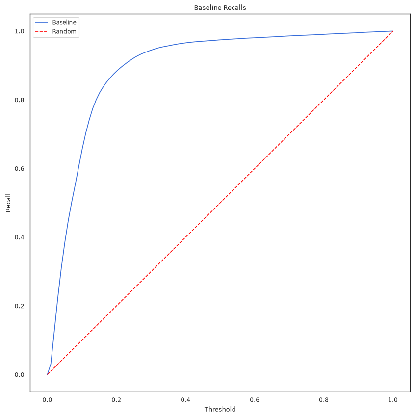
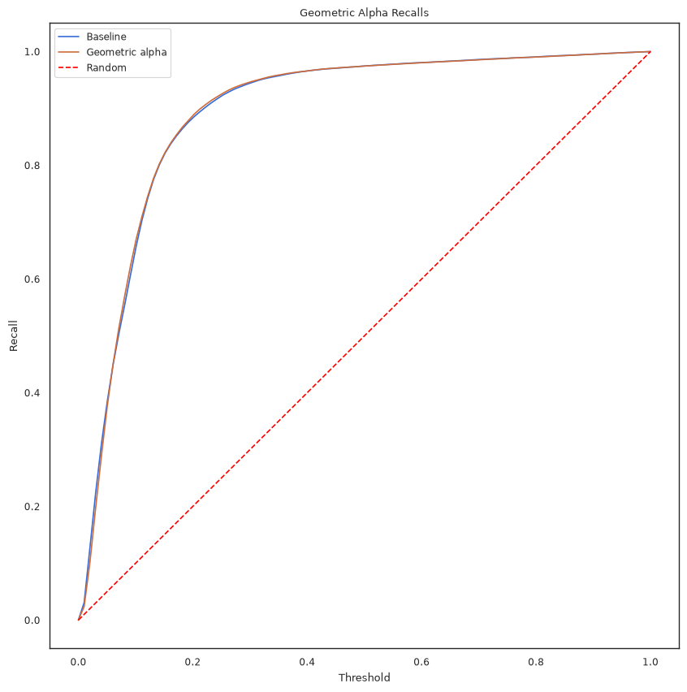
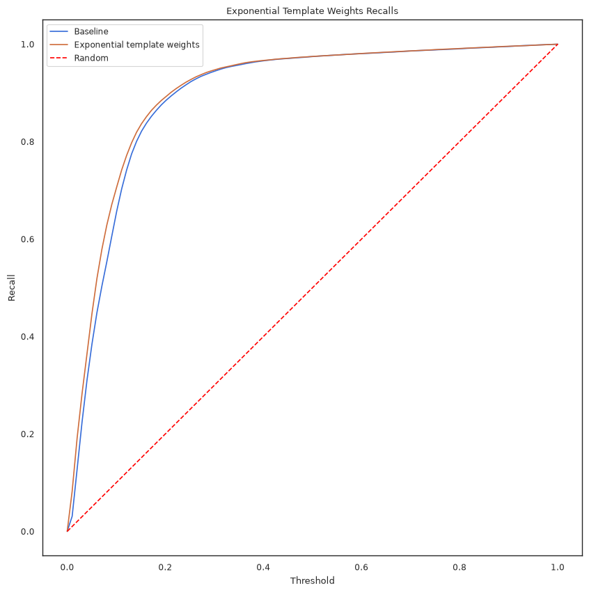
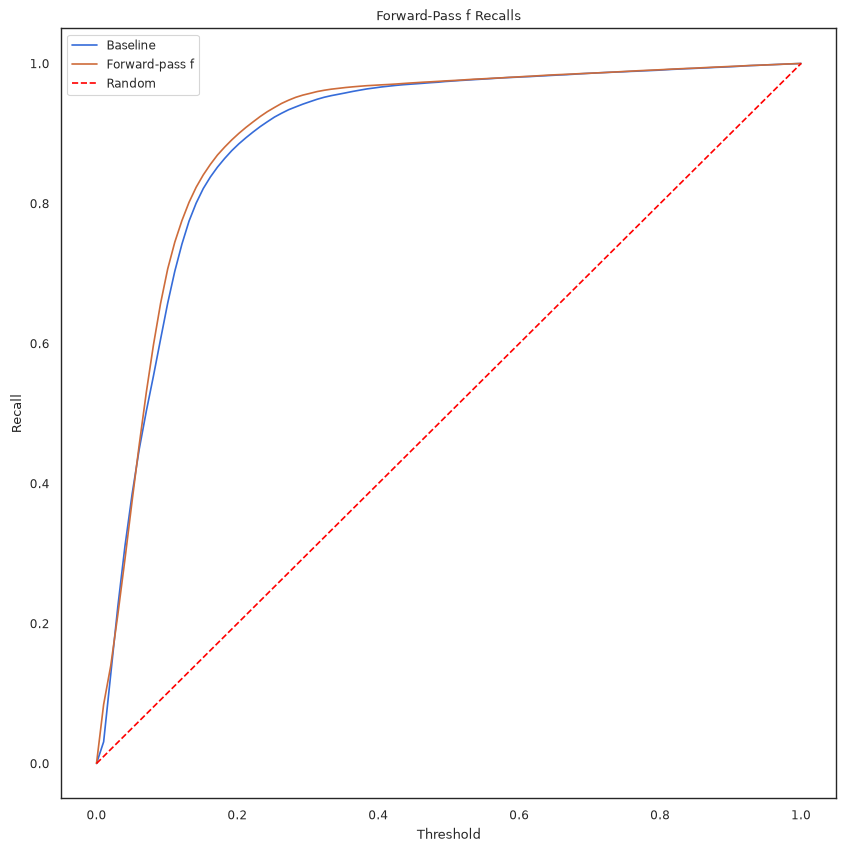
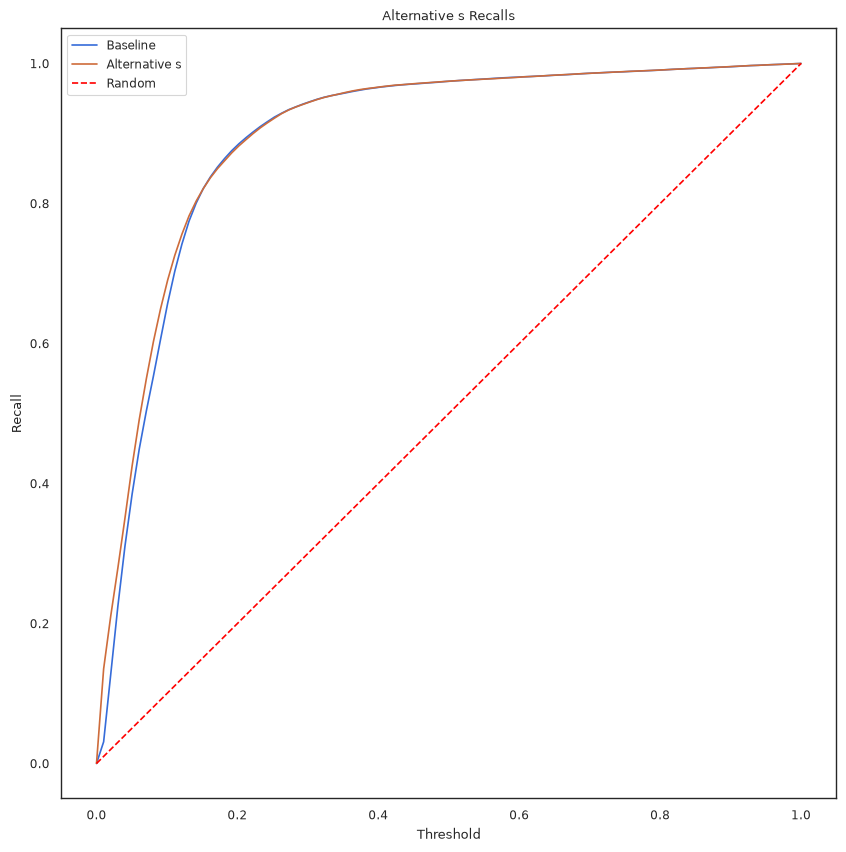

# Refinements to the SAE–Bandit Framework for Active Email Recommendation

**Working draft — extends** Žid, C., Alves, R., and Kordík, P. (2025). *Active Recommendation for Email Outreach Dynamics.* CIKM '25. https://doi.org/10.1145/3746252.3760832

*Tymofii Ivanov, Faculty of Information Technology, CTU Prague*

---

## Abstract

Žid et al. (2025) frame cold-start email recipient selection as an iterative multi-armed bandit, where each arm is a recipient and Thompson Sampling parameters are derived from a shallow autoencoder (SAE) trained on the recipient–template open matrix. In this draft we revisit several components of that framework — the fixed exploration/exploitation coefficient $\alpha$, the historic open-rate term $\phi_j$, the definitions of the influence term $p_j$ and the confidence term $f_j(t)$, the linear form of the score $s_j(t)$, and the exclusive reliance on binary open/no-open labels — and propose concrete, mathematically grounded refinements to each. These include dynamic $\alpha$-scheduling (send-volume-based and open-rate-based), a recency-weighted $\phi_j$, a forward-pass (autoencoder-native) definition of $f_j(t)$, a variance-based definition of $p_j$ motivated by information gain rather than magnitude, a factored score $s_j(t) = \pi_j(t)u_j(t)$ that separates the "probability of opening" axis from the "value of opening" axis, and an extension of the SAE's training target to incorporate time-to-open (TTO) rather than binary opens alone. We report preliminary grid-search results for each proposal against a reproduced baseline. Most variants leave the model's high-percentile recall (Recall@25% and above) close to baseline, but several — most notably the variance-based $p_j$ and the recency-weighted $\phi_j$ — visibly improve recall at very small sending fractions (Recall@5%), which is arguably the regime of greatest practical interest. This document is an early-stage technical report intended as a shared working basis rather than a finished paper: several proposals (notably the TTO-based model variants) are presented with derivations but not yet validated experimentally.

---

## 1. Introduction

Žid et al. propose an active-learning framework for email outreach in which a shallow autoencoder, trained on historical open/no-open data, supplies the arm scores of a Thompson Sampling bandit that selects which recipients receive each new campaign batch. The design is attractive because it requires no retraining during the active-learning phase and remains interpretable, but several of its components were fixed by the original authors for simplicity — a constant blending coefficient $\alpha$, an unweighted historical open-rate, a linear (rather than autoencoder-native) aggregation for the current-state confidence term, and training on binary opens only. Each of these choices is a reasonable starting point but also a natural place to look for improvement.

This document collects a set of refinements explored on top of the original formulation, together with the reasoning behind each, and reports preliminary experimental results. We keep the notation of the original paper wherever possible so that each proposal can be understood as a drop-in replacement for one primitive of the score function, rather than a redesign of the framework as a whole.

### 1.1 Contributions

1. **Dynamic $\alpha$-scheduling.** We reinterpret the fixed coefficient $\alpha$ as an explore/exploit dial and propose three schedules that decay it over the course of active learning: a send-volume-based linear schedule, a send-volume-based geometric (log-linear) schedule, and an open-rate-based ("confidence") hyperbolic schedule.
2. **Recency-weighted historical open rate.** We generalize $\phi_j$ from an unweighted average over past templates to an exponentially recency-weighted average, of which the original definition is a limiting case.
3. **Forward-pass definition of $f_j(t)$.** We replace the linear-combination definition of the current-state confidence term with one that passes the full current open-state through the trained autoencoder, capturing joint (nonlinear) interactions between simultaneous openers rather than only their individually averaged effects.
4. **Variance-based definition of $p_j$.** We replace the mean-based influence score with a variance-based one, arguing that the quantity of interest for information gain is uncertainty *reduction*, not the magnitude of the induced shift.
5. **Factored score function.** We decompose $s_j(t)$ into a probability-of-opening term $\pi_j(t)$ and a utility term $u_j(t)$, each independently schedulable, so that the "historic vs. current data" axis and the "exploration vs. exploitation" axis — conflated in the original linear score — can be controlled separately.
6. **Incorporating time-to-open (TTO).** We propose folding the previously unused time-to-open signal into SAE training via a continuous, exponentially decayed open label, and derive three training variants (binary-input/TTO-target, and a fully continuous TTO-to-TTO variant with two candidate redefinitions of $p_j$).

Sections 2–8 develop each proposal in turn; Section 9 describes the experimental protocol used to evaluate the ones we have tested so far; Section 10 reports results; Section 11 discusses open questions.

---

## 2. Background

### 2.1 Problem Setup and Notation

We observe a matrix $X \in \{0,1\}^{n \times m}$, where $n$ is the number of email templates, $m$ is the number of recipients, and $X_{i,j} = 1$ if recipient $j$ opened template $i$. Given a new template $n+1$ sent in $b$ batches over a window $[0, T]$, the goal is to select, at each batch, which small subset of the remaining recipients should receive the message, so as to maximize how many eventual openers are reached early — before the sending budget is exhausted.

| Symbol | Meaning |
|---|---|
| $n$, $m$ | number of templates, number of recipients |
| $X \in \{0,1\}^{n\times m}$ | historical open matrix |
| $E, D \in \mathbb{R}^{m\times d}$ | SAE encoder / decoder matrices, bottleneck size $d$ |
| $\Sigma = \sigma(B_{E,D})$ | recipient–recipient influence matrix |
| $\phi_j$ | historic open rate of recipient $j$ |
| $p_j$ | influence score of recipient $j$ |
| $f_j(t)$ | current-state confidence score of recipient $j$ at time $t$ |
| $s_j(t)$ | arm score for recipient $j$ at time $t$ |
| $\alpha$ | historic/current (equivalently, explore/exploit) blend coefficient |

### 2.2 Shallow Autoencoder for Collaborative Filtering

A shallow autoencoder is trained on $X$ as

$$\min_{E,D \in \mathbb{R}^{m\times d}} \ell\big(X,\ \sigma(XB_{E,D})\big), \qquad B_{E,D} = ED^\top - \mathrm{diag}\big([E\odot D]\mathbf{1}\big), \tag{1}$$

with $\ell$ the element-wise binary cross-entropy loss and the diagonal constraint on $B_{E,D}$ (standard in this family of models) preventing the trivial identity solution. We write $f_{SAE}(x) = \sigma(x^\top B_{E,D})$ for the map from a binary open-vector to a vector of predicted opening probabilities, and $\Sigma = \sigma(B_{E,D})$ for the corresponding matrix, so that

$$\Sigma_{i,j} = e_i^\top \Sigma e_j = \big[f_{SAE}(e_i)\big]_j. \tag{2}$$

**Remark (indexing convention).** $B_{E,D}$, and hence $\Sigma$, is not symmetric in general, since $E \neq D$. Throughout this document the row index of $\Sigma$ is the recipient who has *already opened* (the conditioning recipient) and the column index is the recipient whose opening probability is being *predicted*. This is the convention under which $p_j$ (Section 2.3, which reads along row $j$) is naturally an *influence* score and $f_j(t)$ (which reads along column $j$) is naturally a *received-influence* score; the original paper's prose description of $\Sigma_{i,j}$ appears to state the two indices in the opposite order, but its own formulas for $p_j$ and $f_j(t)$ are only consistent with the convention adopted here.

### 2.3 Original Arm-Score Function

The original score for recipient $j$ at time $t$ is

$$s_j(t) = \alpha\,\phi_j p_j + (1-\alpha)\,f_j(t), \tag{3}$$

where

$$\phi_j = \frac{1}{n}\sum_{i=1}^n X_{i,j} \quad\text{(historic open rate)}, \qquad p_j = \frac{1}{m-1}\sum_{i \ne j} \Sigma_{j,i} \quad\text{(influence)}, \qquad f_j(t) = \bar x(t)^\top \Sigma_{:,j} \quad\text{(current-state confidence)}, \tag{4}$$

and $\bar x(t) = x(t)/n_t$ is the normalized vector of observed opens for template $n+1$ up to time $t$ ($n_t$ being the number of recipients who have opened so far, or 1 if none have). We use the normalized $\bar x(t)$ rather than the raw $x(t)$ in $f_j(t)$, consistent with the original paper's own description of $f_j(t)$ as a *mean* over recipients who have opened — a mean requires dividing by the number of openers.

The score $s_j(t)$ is a measure of the *usefulness* of sending an email to recipient $j$, not an estimate of the probability that $j$ opens it; it feeds the parameters of a Beta distribution ($\alpha_j(t) = Gs_j(t)$, $\beta_j(t) = G(1-s_j(t))$, with $G$ a confidence modifier) used by Thompson Sampling to select the next batch.

---

## 3. Dynamic $\alpha$-Scheduling

### 3.1 Motivation

The term $\phi_j p_j$ in Eq. (3) is computed purely from historic data (it does not depend on $t$) and rewards recipients whose opening would be *informative* about others — i.e., it drives exploration. The term $f_j(t)$ is computed from interactions observed on the current template and rewards recipients who are *directly likely* to open given what has been observed so far — i.e., it drives exploitation. Under this reading, $\alpha$ is an explore/exploit dial: a higher $\alpha$ favors exploration, a lower $\alpha$ favors exploitation. It is natural to schedule $\alpha$ to decay over the course of active learning, shifting the model from exploration toward exploitation as more of the sending budget is consumed.

### 3.2 Send-Volume-Based Schedules

Let $N(t)$ be the number of emails sent by time $t$ and $N$ the total number of emails that will be sent, and let $\mu = N(t)/N \in [0,1]$. A larger $\mu$ means less of the sending window remains in which to capitalize on information gained from exploration, and should correspond to a smaller $\alpha$.

**Linear schedule.** For endpoints $l, r \in [0,1]$,

$$\alpha(\mu) = l(1-\mu) + r\mu. \tag{5}$$

**Geometric (log-linear) schedule.**

$$\alpha(\mu) = l^{\,1-\mu}\, r^{\,\mu}. \tag{6}$$

### 3.3 Open-Rate-Based ("Confidence") Schedule

A complementary motivation looks not at how much of the budget has been spent, but at how much has actually been *learned*: $f_j(t)$ is itself a mean of $\Sigma_{:,j}$ over recipients who have already opened, so its reliability should increase with the number of observed opens rather than the number of emails sent. Let $o(t) = x(t)^\top \mathbf{1}$ be the number of opens observed by time $t$ and $\tilde o = o(t)/m$. We propose a hyperbolic decay in $\tilde o$,

$$\alpha(\tilde o) = \frac{\kappa}{\tilde o + \kappa}, \tag{7}$$

with dampening factor $\kappa$ (so that $\alpha(\kappa) = 1/2$).

*Practical note.* $\tilde o$ normalizes by the full recipient pool $m$, not by the number of recipients who have received template $n+1$ so far. Given the dataset's baseline open rate of roughly 9% and partial rollout during active learning, $\tilde o$ stays small for most of the active-learning phase, so $\kappa$ likely needs to be tuned to a comparably small value for this schedule to move appreciably; normalizing by recipients-sent-so-far rather than $m$ is a plausible alternative worth testing.

### 3.4 Combined Scheduling

Combining both views — making $\alpha$ a joint function of $\mu$ and $\tilde o$ — is a natural next step, though it introduces additional hyperparameters and has not yet been explored empirically.

---

## 4. Recency-Weighted Historical Open Rate

The original $\phi_j = \frac{1}{n}\sum_i X_{i,j}$ weights every past template equally, disregarding the fact that templates are sent at different times and recipient behavior can drift. We generalize this to an exponentially recency-weighted average. Assuming templates are indexed in send order, define the relative recency of template $i$ as $d_i = (n-i)/n$ and its weight as

$$\omega_i = 2^{-d_i/h}, \tag{8}$$

with half-life $h > 0$. The weighted historic open rate is then

$$\phi_j = \frac{\omega^\top X_{:,j}}{\sum_{i=1}^n \omega_i}, \qquad \omega = (\omega_1,\dots,\omega_n)^\top. \tag{9}$$

Normalizing by $\sum_i \omega_i$ ensures the effective weights form a convex combination, so $\phi_j \in [0,1]$ regardless of $h$. The original, unweighted $\phi_j$ is recovered as $h \to \infty$ (every $\omega_i \to 1$).

---

## 5. Forward-Pass Definition of $f_j(t)$

The original $f_j(t) = \bar x(t)^\top \Sigma_{:,j}$ is a mean of $\Sigma_{:,j}$ over recipients who have opened — i.e., an average of *individual* influences. Because $\Sigma_{:,j}$ is precomputed and this is a linear combination, the combined effect of several simultaneous openers is exactly the average of their separate effects; the definition cannot capture any joint or nonlinear interaction between openers, nor any (negative) influence from recipients who have *not* opened.

We propose instead passing the current binary open-state directly through the trained autoencoder:

$$f_j(t) = \sigma\big(x(t)^\top B_{E,D}\big)_j = \big[f_{SAE}(x(t))\big]_j. \tag{10}$$

Because $\sigma(\cdot)$ is nonlinear, $\sigma(x(t)^\top B_{E,D}) \ne x(t)^\top \sigma(B_{E,D})$ in general — the two coincide only when $x(t)$ is one-hot (exactly one opener so far). Eq. (10) therefore reflects the probability of $j$ opening given the *joint* current state, incorporating the combined effect of all openers and non-openers together, rather than a per-recipient average.

**Remark.** Eq. (10) deliberately uses the raw $x(t) \in \{0,1\}^m$, not the normalized $\bar x(t)$. This differs from Eq. (4), where normalizing was benign because it converted a sum of already-bounded, already-sigmoided quantities into a mean. Here the sigmoid is applied *after* aggregation, to a raw logit; scaling that logit by $1/n_t$ before the sigmoid does not correspond to any meaningful normalization — it simply shrinks the logit's magnitude and pushes the output toward $0.5$ as more recipients open, i.e., toward *maximum* uncertainty, which is the opposite of the intended effect of accumulating more observations. $x(t)$ is also the more faithful input in distributional terms: it is binary, exactly like the rows of $X$ the autoencoder was trained on, whereas $\bar x(t)$'s fractional entries are out of distribution relative to training.

---

## 6. Variance-Based Definition of $p_j$

$p_j$ is meant to measure the information gain from sending an email to recipient $j$ — i.e., how much observing $j$'s outcome would sharpen our estimate of $f_i(t)$ for other recipients $i$. The original definition,

$$p_j = \frac{1}{m-1}\sum_{i \ne j} \Sigma_{j,i}, \tag{11}$$

is the mean of row $j$ of $\Sigma$: it measures the overall *level* to which other recipients' $f_i(t)$ scores would shift if $j$ opens. This rewards recipients whose opening would push others' scores up the most, which is not the same thing as rewarding recipients whose opening would most reduce *uncertainty* about others' scores — the latter being the actual objective of information gain.

We propose instead rewarding recipients who induce the greatest *separation* (variance) of $\Sigma_{j,:}$, i.e., recipients whose outcome most strongly discriminates between "will open" and "won't open" among the rest of the population:

$$p_j = \frac{4}{m-1}\sum_{i \ne j}\big(\Sigma_{j,i} - \bar\Sigma_{j:}\big)^2, \qquad \bar\Sigma_{j:} = \frac{1}{m-1}\sum_{i \ne j}\Sigma_{j,i}. \tag{12}$$

This is the (population) variance of row $j$ of $\Sigma$, scaled by 4 so that the maximum possible variance of a Bernoulli-distributed quantity (0.25) maps to 1, keeping $p_j \in [0,1]$ as in the original definition.

---

## 7. Factored Score Function

The two terms of $s_j(t)$ carry two orthogonal interpretations: $\phi_j p_j$ vs. $f_j(t)$ is a *historic-vs-current-data* distinction, while (per Section 3.1) it is also an *exploration-vs-exploitation* distinction. The original linear combination (Eq. 3) conflates the two — for instance, it is not obvious why exploration should be based solely on historic data while exploitation is based solely on current data.

We propose factoring $s_j(t)$ into a probability-of-opening estimate and a utility term, each blending historic and current information (or influence and direct value) independently:

$$\pi_j(t) = \alpha(t)\phi_j + (1-\alpha(t))f_j(t) \qquad \text{(estimated probability of opening)}, \tag{13}$$

$$u_j(t) = \beta(t)p_j + (1-\beta(t))\cdot 1 \qquad \text{(utility of } j \text{ opening)}, \tag{14}$$

$$s_j(t) = \pi_j(t)\, u_j(t) = \Big(\alpha(t)\phi_j + [1-\alpha(t)]f_j(t)\Big)\Big(\beta(t)p_j + [1-\beta(t)]\Big). \tag{15}$$

In $u_j(t)$, the constant term $1$ represents the direct value of $j$ opening (a "conversion" in its own right), while $p_j$ represents the indirect value of $j$ opening through information gained about other recipients; $\beta(t)$ trades these off. With $\alpha(t)$ and $\beta(t)$ scheduled independently — for instance, $\alpha(t)$ via the open-rate-based (confidence) schedule of Section 3.3 and $\beta(t)$ via a send-volume-based schedule from Section 3.2 — the historic/current axis and the exploration/exploitation axis can be tuned separately.

A practical advantage of this factoring is that it is purely a recombination of existing primitives ($\phi_j$, $p_j$, $f_j(t)$, and the $\alpha$-schedules of Section 3), so every other proposal in this document (recency-weighted $\phi_j$, forward-pass $f_j(t)$, variance-based $p_j$) can be substituted in directly.

**Notation note.** The original paper already overloads $\alpha$: the score-blend coefficient of Eq. (3) and the Beta-distribution shape parameter $\alpha_j(t) = Gs_j(t)$ used by Thompson Sampling share a symbol but denote unrelated quantities. The $\beta(t)$ introduced here in Eq. (14) is a *third*, again unrelated, quantity from the Beta-distribution parameter $\beta_j(t) = G(1-s_j(t))$. Readers implementing this section should keep the three uses distinct; a renaming pass (e.g., $\lambda(t)$ for the score-blend coefficient and $\gamma(t)$ for the utility-blend coefficient) is worth doing before this becomes a shared codebase.

---

## 8. Incorporating Time-to-Open (TTO)

The SAE of Eq. (1) is trained purely on the binary matrix $X$, discarding a signal available for every observed open: how long it took. Two recipients who both eventually open a template are treated identically whether they opened in five minutes or five days — even though, given the short operational window between batches, only fast opens are actually actionable during active learning. This section explores folding time-to-open into SAE training.

### 8.1 TTO Matrix and Decayed Labels

Let $\Delta \in (\mathbb{R}_{\ge 0} \cup \{+\infty\})^{n\times m}$ record the observed time-to-open, with $\Delta_{i,j} = +\infty$ if recipient $j$ never opened template $i$. Note $X_{i,j} = \mathbb{1}[\Delta_{i,j} < \infty]$, so $\Delta$ is strictly more expressive than $X$. We define a continuous, exponentially decayed open label (matching the exponential form already used for template recency in Section 4),

$$Y_{i,j} = 2^{-\Delta_{i,j}/h_\delta}, \tag{16}$$

with TTO half-life $h_\delta > 0$ and the convention $2^{-\infty} = 0$, so $Y_{i,j} = 0$ for non-openers and $Y_{i,j} \in (0,1]$ for openers, smoothly discounting slow opens. As $h_\delta \to \infty$, $Y_{i,j} \to X_{i,j}$ for every opener, recovering the original binary model exactly — the same limiting relationship used for the recency weights of Section 4. A hyperbolic alternative, $Y_{i,j} = \kappa_\delta/(\Delta_{i,j}+\kappa_\delta)$ (mirroring Eq. 7), has a heavier tail and remains to be compared empirically against Eq. (16).

Because the two decays (template recency, opening speed) are orthogonal, $Y$ composes directly with the recency-weighted $\phi_j$ of Section 4:

$$\phi_j = \frac{\omega^\top Y_{:,j}}{\sum_{i=1}^n \omega_i}. \tag{17}$$

We consider two training variants below, distinguished by whether the SAE's *input* space stays binary or is also replaced by continuous $Y$.

### 8.2 Model A: Binary-Input, TTO-Target ($X \to Y$)

The simplest variant keeps the input binary and only replaces the reconstruction target:

$$\min_{E,D}\ \ell\big(Y,\ \sigma(XB_{E,D})\big). \tag{18}$$

Since the input space is unchanged, $p_j$ (Eq. 11 or 12) carries over mechanically unchanged, evaluated on $\Sigma^Y = \sigma(B_{E,D})$ trained under (18). The interpretation shifts, however: $\Sigma^Y_{j,i}$ no longer represents a plain probability that $i$ opens given only $j$ opened — it is now a TTO-decayed, "speed-weighted" version of that quantity, blending *whether* $i$ would open with *how fast*. This shift propagates through to $p_j$, $f_j(t)$, and $s_j(t)$.

At inference, $f_j(t)$ can still be computed exactly as in Section 5 using the binary $x(t)$. Optionally, the TTO of recipients who have *already* opened template $n+1$ can also be exploited via the following extension.

**The $z(t)$ interpolation extension.** Define a continuous, partially TTO-informed state vector

$$z_j(t) = \begin{cases} 2^{-\delta_j/h_\delta} & j \text{ has opened by } t \\ 0 & \text{otherwise,} \end{cases} \tag{19}$$

where $\delta_j$ is $j$'s observed TTO for template $n+1$, and set $f_j(t) = \sigma(z(t)^\top B_{E,D})_j = [f_{SAE}(z(t))]_j$.

*Validity note.* $x^\top B_{E,D}$ is linear in $x$, and $z(t) \in [0,1]^m$ always — regardless of whether $B_{E,D}$ was fit only on binary corners of the hypercube. The only nonlinearity in $f_{SAE}$ is the final sigmoid, which is smooth and bounded everywhere, so evaluating $f_{SAE}$ at $z(t)$ is a mathematically well-posed extension of a model trained on binary rows. Whether it is *empirically* useful — whether early openers' TTO carries predictive signal beyond the binary $x(t)$ — remains to be validated.

### 8.3 Model B: TTO-Input, TTO-Target ($Y \to Y$)

A more expressive variant also lets the SAE see TTO information on the input side:

$$\min_{E,D}\ \ell\big(Y,\ \sigma(YB_{E,D})\big), \qquad Y_{i,j} \in [0,1). \tag{20}$$

Here $e_j$ (corresponding to $\delta_j = 0$, an instantaneous open) is a boundary point of the training distribution rather than a typical one: querying $\Sigma^Y_{j,:}$ at $e_j$ answers "if $j$ opened as fast as physically possible," not "if $j$ opened." Consequently, $p_j$ should **not** be computed at $e_j$ under this model.

**Redefining $p_j$ under Model B.** Instead, we query $f_{SAE}$ at a point representative of the training distribution, scaled to a magnitude the model actually saw during training. Two variants:

*Recipient-scaled:*

$$p_j = \frac{1}{m-1}\sum_{i\ne j} \big[f_{SAE}(\bar Y_j\, e_j)\big]_i, \qquad \bar Y_j = \frac{1}{n}\sum_{i=1}^n Y_{i,j}. \tag{21}$$

This asks "what if $j$ opens the way $j$ typically does," a realistic expected effect rather than a counterfactual best case. Note, however, that $\bar Y_j$ is (up to the choice of decay) the same quantity as $\phi_j$; this variant bakes $j$'s own activity level into the query magnitude of $p_j$, while $s_j(t)$ (or $\pi_j(t)$ in Section 7) still multiplies by $\phi_j$ separately. The original design deliberately kept activity ($\phi_j$) and magnitude-free influence ($p_j$) as independent, multiplicatively combined axes; this variant partially collapses that separation and risks double-counting activity — whether $\phi_j$ should still appear separately under this variant is an open question.

*Population-mean (decoupled):*

$$p_j = \frac{1}{m-1}\sum_{i\ne j} \big[f_{SAE}(\bar Y\, e_j)\big]_i, \qquad \bar Y = \frac{1}{nm}\sum_{k=1}^n\sum_{l=1}^m Y_{k,l}. \tag{22}$$

Querying at the population mean rather than recipient $j$'s own mean avoids the coupling above at the cost of a coarser question ("what if $j$ opens at a rate typical for *any* recipient"). This preserves the original clean separation between $\phi_j$ and $p_j$, and is the safer default of the two pending empirical comparison.

$f_j(t)$ under Model B can reuse the $z(t)$ construction of Eq. (19); if anything, $z(t)$ is more in-distribution here, since the model was trained on continuous inputs throughout.

### 8.4 Downstream Calibration of $G$

Regardless of which TTO variant is used, $s_j(t)$ continues to feed the Beta-distribution parameters $\alpha_j(t) = Gs_j(t)$, $\beta_j(t) = G(1-s_j(t))$. Moving to a TTO-blended $\Sigma^Y$ shifts the numeric range and distribution of $s_j(t)$ relative to the original $X$-based $\Sigma$, so $G$ — originally tuned against the binary model — likely needs re-tuning under any of the Model A/B variants above.

---

## 9. Experimental Setup

We evaluate each proposal via grid search over its hyperparameters, selecting the best-performing configuration on a validation set, then reporting test-set performance. As our validation and reporting metric we use the area under the recall curve,

$$\mathrm{AUC} = \int_0^1 \mathrm{Recall}(\tau)\, d\tau, \tag{23}$$

where $\mathrm{Recall}(\tau)$ is recall at sending fraction $\tau$ (the fraction of recipients who ultimately receive the message). For each experiment we report Recall-AUC together with Recall@5%, @15%, @25%, and @35%, plus a smoothed recall curve on the test set. This differs from the original paper's reported operating points (25%/50%/75%); we additionally probe low sending fractions (5%, 15%) since that is the regime in which reducing the number of sent emails while preserving recall is most consequential in practice, and where most of the framework's headroom for improvement is likely to be found once recall is already high at 50–75%.

---

## 10. Results

### 10.1 Reproduction Check

Before testing modifications, we reproduced the original model on our evaluation pipeline and compared against the original paper's reported operating points (Recall@25/50/75%):

| | Recall@25% | Recall@50% | Recall@75% |
|---|---|---|---|
| Original paper | 0.923 ± 0.0005 | 0.975 ± 0.0002 | 0.989 ± 0.0004 |
| Our reproduction | 0.923 ± 0.014 | 0.975 ± 0.008 | 0.989 ± 0.004 |

Point estimates match the published results exactly; our reproduction shows larger variance, consistent with a smaller number of simulation runs.

### 10.2 Baseline and Proposed Variants

All results below use our evaluation protocol (Section 9: Recall@5/15/25/35% and Recall-AUC), reported as mean ± standard deviation over repeated simulations.

| Variant | Selected hyperparameters | Recall@5% | Recall@15% | Recall@25% | Recall@35% | AUC |
|---|---|---|---|---|---|---|
| Baseline | — | 0.385 ± 0.076 | 0.821 ± 0.028 | 0.923 ± 0.014 | 0.958 ± 0.011 | 0.894 ± 0.012 |
| Linear $\alpha$-schedule | $l=0.1,\ r=0.05$ | 0.383 ± 0.073 | 0.823 ± 0.023 | 0.927 ± 0.012 | 0.960 ± 0.010 | 0.894 ± 0.011 |
| Geometric $\alpha$-schedule | $l=0.3,\ r=0.05$ | 0.377 ± 0.050 | 0.823 ± 0.017 | 0.927 ± 0.012 | 0.959 ± 0.010 | 0.894 ± 0.009 |
| Confidence $\alpha$-schedule | $\kappa=0.003$ | 0.341 ± 0.031 | 0.818 ± 0.022 | 0.926 ± 0.014 | 0.960 ± 0.010 | 0.891 ± 0.009 |
| Recency-weighted $\phi_j$ | $h=0.3$ | 0.447 ± 0.041 | 0.837 ± 0.018 | 0.928 ± 0.014 | 0.960 ± 0.011 | 0.903 ± 0.009 |
| Forward-pass $f_j(t)$ | — | 0.375 ± 0.049 | 0.841 ± 0.029 | 0.937 ± 0.018 | 0.966 ± 0.010 | 0.901 ± 0.011 |
| Factored $s_j(t)$ | $\alpha(t)$: confidence, $\kappa=0.005$; $\beta(t)$: geometric, $l=0.1,\ r=0.05$ | 0.425 ± 0.026 | 0.821 ± 0.017 | 0.922 ± 0.013 | 0.959 ± 0.010 | 0.900 ± 0.008 |
| Variance-based $p_j$ | — | 0.479 ± 0.034 | 0.837 ± 0.017 | 0.926 ± 0.013 | 0.960 ± 0.010 | 0.905 ± 0.009 |

TTO incorporation (Section 8) is not yet included in this results table; it is presented above purely as a derivation pending implementation.

---

## 11. Discussion and Open Questions

**Where the gains concentrate.** Across variants, differences from baseline are largest at the lowest sending fraction (Recall@5%) and shrink as the sending fraction grows, which is expected: baseline recall already exceeds 0.92 by 25%, leaving little headroom for any variant to improve on at that point. The largest Recall@5% improvements come from the variance-based $p_j$ (0.479 vs. 0.385 baseline) and the recency-weighted $\phi_j$ (0.447), followed by the factored $s_j(t)$ (0.425). The $\alpha$-scheduling variants alone show little to no improvement at 5% and, for the confidence schedule, a *decrease* (0.341) — consistent with the practical note in Section 3.3 that this schedule's effective range may be too narrow given the dataset's baseline open rate; the choice of $\kappa$ likely needs revisiting, or normalization by recipients-sent-so-far rather than $m$.

**Open questions carried over from the derivations above:**
- Whether combined $\alpha$-scheduling (joint function of $\mu$ and $\tilde o$, Section 3.4) is worth its added hyperparameter count.
- Whether $\phi_j$ should still appear separately in $s_j(t)$/$\pi_j(t)$ under the recipient-scaled Model B redefinition of $p_j$ (Eq. 21), given the activity-level double-counting risk noted in Section 8.3.
- Empirical comparison of the exponential (Eq. 16) vs. hyperbolic TTO decay forms for $Y$.
- Re-tuning $G$ under any TTO-based variant (Section 8.4).
- All experiments to date test one modification at a time; joint search over combinations (e.g., variance-based $p_j$ together with recency-weighted $\phi_j$) has not yet been run and may compound the individual gains seen here.

---

## 12. Conclusion and Future Work

We have proposed six refinements to the SAE–Thompson Sampling framework of Žid et al. (2025), spanning the score function's blend coefficient, its historic and influence terms, its current-state confidence term, its overall factorization, and the training signal available to the underlying autoencoder. Preliminary single-modification experiments suggest the largest practical gains are concentrated at low sending fractions, with the variance-based influence score and recency-weighted open rate the strongest individual candidates so far. Immediate next steps are: (1) implement and evaluate the TTO-based training variants of Section 8; (2) run combined-modification experiments rather than isolated ablations; and (3) resolve the notation collisions flagged in Section 7 before this becomes a shared codebase.

---

## References

Žid, Č., Alves, R., and Kordík, P. 2025. Active Recommendation for Email Outreach Dynamics. In *Proceedings of the 34th ACM International Conference on Information and Knowledge Management (CIKM '25)*, November 10–14, 2025, Seoul, Republic of Korea. ACM, New York, NY, USA, 5 pages. https://doi.org/10.1145/3746252.3760832
