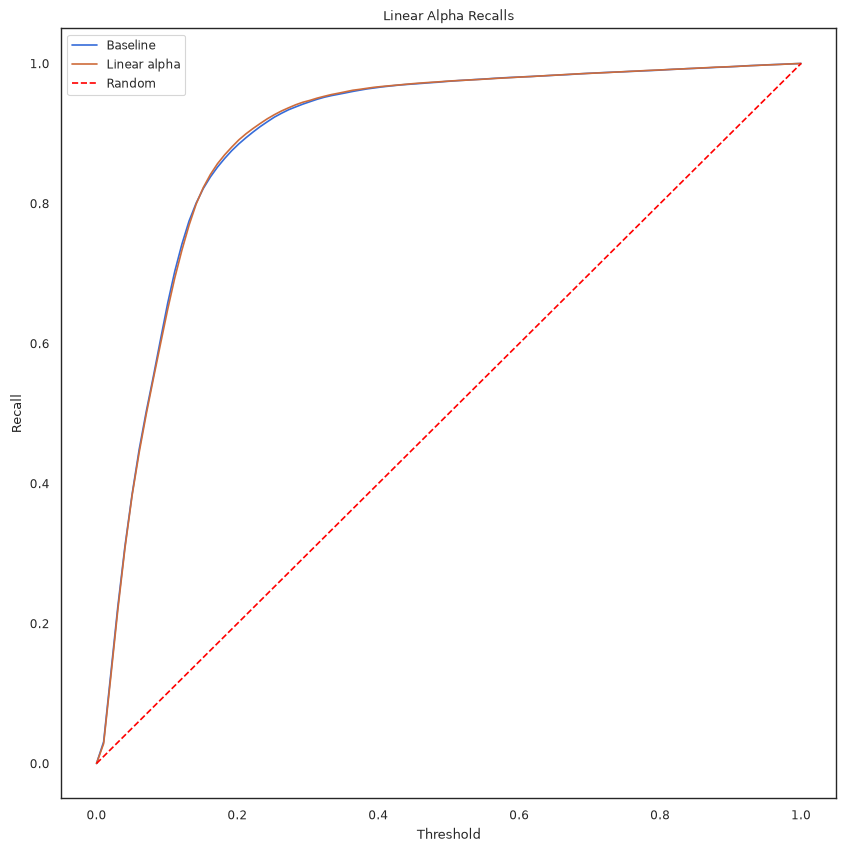
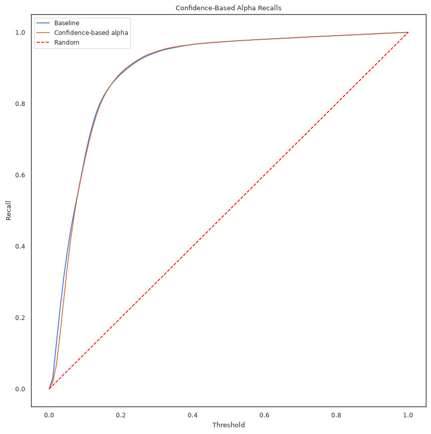
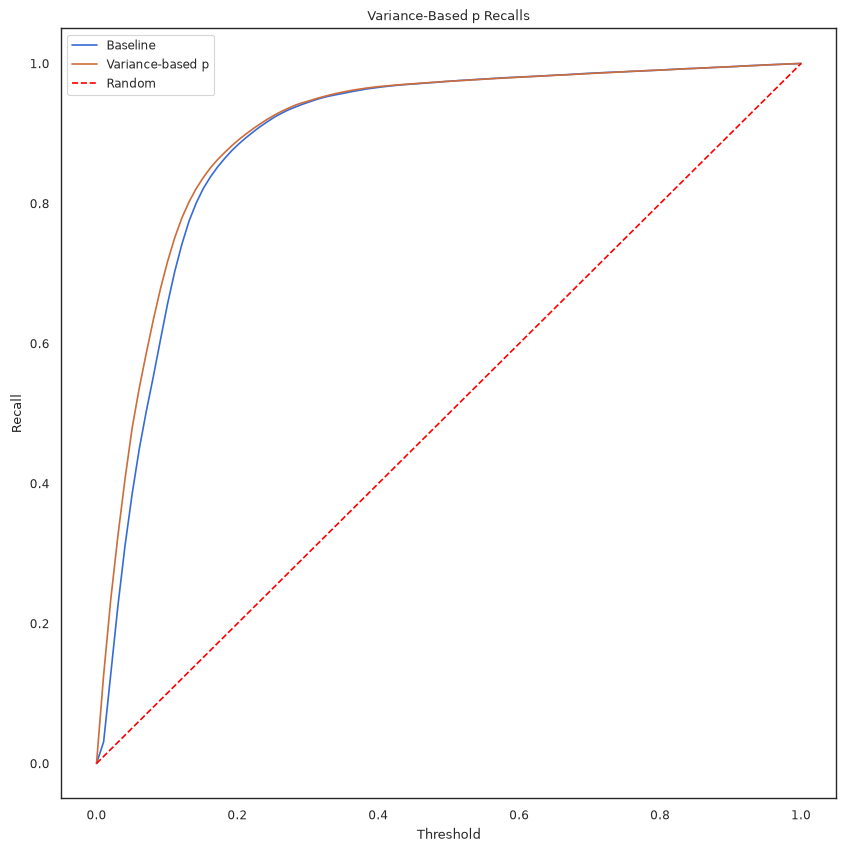
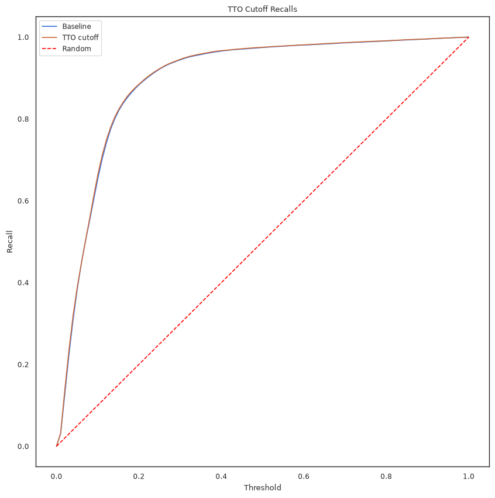
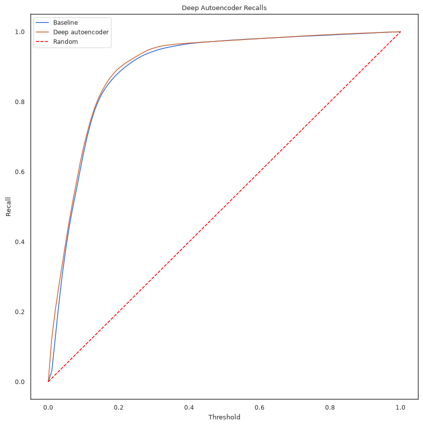

# Active Recommendation for Email Outreach Dynamics Improvement Notes

This document contains notes on possible improvements and refinements of the Contextual Multi Arm Bandit with Thompson
Sampling model established
by [Active Recommendation for Email Outreach Dynamics](https://dl.acm.org/doi/10.1145/3746252.3760832) paper

We explore different practical and theoretical refinements to the model.

## Recap

TBA

### Dataset

We consider dataset $\mathbb{X} \in \{0, 1\}^{n,m}$ where n is a number of templates, m is a number of recepients
and $X_{i,j} = 1$ if user $j$
opened email template $i$ and $0$ otherwise.

### Autoencoder

We train a shallow autoencoder (SAE) as follows:

$$\min_{E,D \in \mathbb{R}^{m, d}} l (X, \sigma (X B_{E,D}))$$

where

$$B_{E,D} = E D^T - diag[(E \odot D) \mathbf{1}]$$

and $l$ is element-wise BCE loss

Given the trained autoencoder, we define a function
$f_{SAE} (x) = \sigma (x B_{E,D})$ which maps a binary vector of opened templates to a vector of probabilities of
opening other templates.

Additionally, we define $\Sigma = \sigma (B_{E,D})$. Note that
$\Sigma_{i,j} = e_i^T \Sigma e_j = f_{SAE} (e_i)e_j$. Thus,
$\Sigma_{i,j}$ represents a probability of user $j$ opening a template if only user $i$ has already opened it - a
measure of influence of user
$i$ on user $j$.

> **Note on direction/asymmetry:** $B_{E,D}$ (and hence $\Sigma$) is
> *not* symmetric in general, since $E \neq D$, so
> $\Sigma_{i,j} \neq \Sigma_{j,i}$ in general. Throughout this document
> the convention is: **row index = the recipient who has already opened
> (the "source"/conditioner), column index = the recipient whose opening
> probability is being predicted (the "target")**. This is the
> convention that makes $p_j$ (below, uses row $j$) an *influence* score
> and $f_j (t)$ (below, uses column $j$) a
> *received-influence/confidence* score. It's worth flagging that the
> paper's own prose description of $\Sigma_{i,j}$ ("probability that $i$
> opens given only $j$ opened") reads with $i$/$j$ reversed relative to
> this convention — but the paper's own formulas for $p_j$ and $f_j (t)$
> only work under the convention above, so this appears to be a swap in
> the paper's descriptive text rather than an error in this reasoning.

### Arms score function

The core part of the model is the arms score function, which is defined as:
$$s_j (t) = \alpha \cdot \phi_j p_j + (1 - \alpha) \cdot f_j (t)$$

Where:

$$\phi_j = \frac{1}{n}\sum_{i=1}^{n} X_{i,j}$$

- The historic probability of user $j \in \{1,2,...,m\}$ opening an email

$$p_j = \frac{1}{m-1}\sum_{i=1, i\ne j}^{m} \Sigma_{j,i}$$

- Measure of influence of user $j$ opening an email from a template on other users opening their email from this
  template.

$$f_j (t) = \bar x (t)^T \Sigma_{:j}$$

- Measure of probability of user $j$ opening an email from template at time $t$ given the current state of opened
  templates $x (t)$.

> **Note on normalization:** the published paper's Eq. (4) writes this
> term with the *unnormalized* $x_{n+1} (t)$ rather than
> $\bar x_{n+1} (t)$. We use the normalized
> $\bar x_{n+1} (t) = x_{n+1} (t)/n_t$ throughout, consistent with the
> paper's Figure 1.
> Unnormalized version would result in the possiblity of $s_j (t)$ being out of range [0,1], breaking the Thomson
> Sampling part of pipeline (negative betta parameter).

## Alpha Scheduling

The model presented in the paper uses a fixed alpha coefficient
$\alpha \in [0,1]$. We further explore the possibility of using a dynamic alpha coefficient $\alpha (t)$ that changes
over time.

The overall score $s_j (t)$ for a given user $j$ is not a measure of probability of user $j$ opening an email, but
rather a measure of
"usefulness" of sending an email to user $j$.

### Sent Mail - Based Alpha Scheduling

As was noted in previous sections $\phi_j$ represents a historic estimate of probability of user $j$ opening an email,
while $p_j$
represents a measure of "influence" of user $j$ on other users opening their emails. Thus, the part $\phi_j p_j$
represents the informativeness of sending an email to user $j$ in terms of gaining more information about other users -
which corresponds to exploration.

On the other hand, $f_j (t)$ represents a measure of direct probability of user $j$ opening an email given the current
state of opened templates - which corresponds to exploitation.

Thus $\alpha$ can be interpreted as a measure of exploration vs exploitation trade-off. A higher $\alpha$ corresponds to
more exploration, while a lower $\alpha$ corresponds to more exploitation.

In this spirit, it is reasonable to use alpha scheduling with decreasing value of alpha, representing gradual shift from
exploration to exploitation.

Let $N (t)$ represent the number of total emails sent at time $t$ and
$N$ - total number of emails we send overall.

> **Renamed from** $m (t)$/$M$: the original draft used $m (t)$ and $M$
> for these quantities, but $m$ is already fixed throughout this
> document as the total recipient count (and reappears below in
> $\tilde o = o (t)/m$). Renaming to $N (t)$/$N$ avoids that collision —
> no formula changes here, just notation.

In this context, we consider $\alpha$ to be a function of ratio
$\mu = \frac{N (t)}{N}$. Greater fraction represents smaller window for capitalizing on information gained from
exploration - and should result in a smaller value of alpha.

#### Linear Alpha Scheduling

We consider a linear (in terms of $\mu$) decrease of $\alpha (\mu)$ from
$l \in [0,1]$ to $r \in [0,1]$:
$$\alpha (\mu) = l \cdot (1-\mu) + r \cdot \mu$$

In terms of $t$:

$$\alpha (t) = l \cdot (1-\frac{N (t)}{N}) + r \cdot \frac{N (t)}{N}$$

#### Geometric (Log-Linear) Alpha Scheduling

We consider a geometric/log-linear (in terms of $\mu$) decrease of
$\alpha (\mu)$ from $l \in [0,1]$ to $r \in [0,1]$:
$$\alpha (\mu) = l ^ { (1-\mu)} \cdot r ^ {\mu}$$

In terms of $t$:

$$\alpha (t) = l ^ { (1-\frac{N (t)}{N})} \cdot r ^ \frac{N (t)}{N}$$

### Open Mail - Based Alpha Scheduler

An alternative (complementary) view on the 2 parts of a score function
$s_j (t)$ is that the first part $\phi_j p_j$ is calculated completely based on historic data (notice it does not depend
on $t$), while
$f_j (t)$ is based on actual observed interactions in the current template (notice the dependence on $t$ and the fact
that $f_j (0) = 0$).

Thus, another motivation for decreasing alpha comes from increasing
"trust" in $f_j (t) = \bar x (t)^T \Sigma_{:j}$ - which itself is a mean (point-estimate) of values in $\Sigma_{:j}$
among recipients who have already opened an email.

Let $o (t)$ represent number of opened emails at time $t$
($o (t) = x (t) ^ T \mathbf{1}$)

Thus, $\alpha (t)$ should be a decreasing function of
$\tilde o = o (t)/m$ - proportion of opened emails at time $t$ to the number of users - representing a transition from
historic data based estimates to actual observed interactions - based estimates.

#### Confidence Alpha Scheduling

We consider a Hyperbolic (in terms of $\tilde o$) decrease of alpha

$$\alpha (\tilde o) = \frac{\kappa}{\tilde o + \kappa}$$
Here $\kappa$ - is a dampening factor ($\alpha (\kappa) = \frac{1}{2}$)

In terms of time:
$$\alpha (t) = \frac{\kappa}{o (t)/m + \kappa}$$

> **Practical note:** $\tilde o$ normalizes by the *total* recipient
> pool $m$, not by how many recipients have actually received template
> $n+1$ so far. Given a \~9% baseline open rate and partial rollout
> during active learning, $\tilde o$ will stay quite small for most of
> the active learning phase, so $\alpha (\tilde o)$ may barely move
> unless $\kappa$ is tuned to a comparably small value (well below
> typical eventual open-rate levels).

#### Combined Alpha Scheduling

It might be interesting to combine both approaches to alpha scheduling, where $\alpha (t)$ is a function of both $\mu$
and $\tilde o$, though this idea remains to be explored (excessive number of hyperparameters might be a problem).

## Template Weights

The original model definition of historic probability of opening an
email $$\phi_j = \frac{1}{n} \sum_{i=1}^{n} X_{i,j}$$ gives equal weight to each template $X_{i:}$

However, this disregards the fact that the templates were sent at different times, and that user behavior can change
over time.

Thus, it is reasonable to consider a weighted average of opened templates, where more recent templates have higher
weights than older templates.

### Exponential Template Weights

We assume that templates are sent at uniform time intervals, ordered by their index $i$ (that is, template $X_{1:}$ was
sent first, template
$X_{2:}$ was sent second, and so on).

For a given template $X_{i:}$ we define its weight as:
$$\omega_i = 2 ^ { (\frac{-d_i}{h})}$$

where
$$d_i = \frac{n-i}{n}$$

- relative time since template $X_{i:}$ was sent

Where $h \gt 0$ is the half-life of the weight decay.

The weighted average of opened templates is then defined as:
$$\phi_j = (\omega^T X_{:j}) / \sum_{i=1}^{n} \omega_i$$

Where

$$\omega = \begin{bmatrix} \omega_1 \\ \omega_2 \\ ... \\ \omega_n \end{bmatrix}$$

Dividing by $\sum_i \omega_i$ ensures the *effective* weights
$\omega_i / \sum_k \omega_k$ form a proper convex combination (they sum to 1), which guarantees $\phi_j \in [0,1]$
regardless of the raw magnitude of the $\omega_i$.

Note that the original definition of $\phi_j$ is a special case of this weighted average with uniform weights
(as $h \to \infty$, every
$\omega_i \to 1$).

## Forward-Pass f Definition

The current definition of $f_j (t) = \bar x (t)^T \Sigma_{:j}$ is a mean of values in $\Sigma_{:j}$ among recipients who
have already opened an email - thus representing mean influence of users who have already opened an email on user $j$
opening an email.

However, this definition considers only individual recipients' influences and disregards their interactions.
Because $\Sigma_{:j}$ is precomputed and $\bar x (t)^T \Sigma_{:j}$ is a linear combination of its entries, the combined
effect of multiple simultaneous openers is just the average of their individual effects — it cannot capture any joint
interaction between openers.

We propose a refined definition of $f_j (t)$ that instead passes the full current state through the trained autoencoder
directly, taking into consideration the combined influence of users who opened an email on user $j$ opening an email, as
well as the influence of users who have not opened an email on user $j$ opening an email:

$$f_j (t) = \sigma (x (t)^T B_{E,D}) e_j = f_{SAE} (x (t)) e_j$$

> **Deliberately using raw** $x (t)$, not $\bar x (t)$, here. This is the
> and the distinction matters:
>
> - In the *original* $f_j (t) = \bar x (t)^T \Sigma_{:j}$ above, dividing
>   by $n_t$ converts a sum of already-bounded, already-sigmoided
>   quantities ($\Sigma_{i,j} \in [0,1]$) into a mean. That's a benign,
>   well-justified normalization.
> - Here, the sigmoid is applied *after* aggregation, to the raw logit
>   $x (t)^T B_{E,D}$. Scaling that logit by $1/n_t$ before the sigmoid
>   doesn't "normalize" anything meaningful — it just shrinks the
>   logit's magnitude, which pushes $\sigma (\cdot)$ toward $0.5$
>   regardless of the true underlying signal (and regardless of the sign
>   of entries in $B_{E,D}$, which can be positive or negative). As more
>   recipients open ($n_t$ grows), this would systematically drag
>   $f_j (t)$ *toward maximum uncertainty* — the opposite of what more
>   observed opens should do to confidence.
> - $x (t)$ is also simply the more faithful input: it's defined to be
>   binary, $\{0,1\}^m$, exactly like the rows of $X$ the autoencoder
>   was trained on. $\bar x (t)$, with fractional entries like $1/n_t$,
>   is the input that's out of distribution relative to training — not
>   the other way around.

Because $\sigma (\cdot)$ is nonlinear,
$\sigma (x (t)^T B_{E,D}) \neq x (t)^T \sigma (B_{E,D}) = x (t)^T \Sigma$ in general (they coincide only when $x (t)$ is
one-hot, i.e. exactly one opener). So $f_{SAE} (x (t))$ is a vector of probabilities of opening templates given the
*joint* current state of opened templates $x (t)$, and the refined $f_j (t)$ represents a probability of user $j$
opening an email given the current state of opened templates, taking into account both individual and combined
influences of users who have opened an email.

# Variance-Based p Definition

As was noted in previous sections, it is desirable that $p_j$ represents a measure of information gain from sending an
email to user $j$ in terms of gaining more information about other users, given that user $j$ opens their email.

The only way this information can be utilized is a change in $f_j (t)$ scores of other users.

However, the current definition of
$$p_j = \frac{1}{m-1}\sum_{i=1, i\ne j}^{m} \Sigma_{j,i}$$
is a mean of values in $\Sigma_{j:}$ among all recipients except user $j$ - thus representing an overall change of level
of estimated $f_j (t)$ values for other users if user $j$ opens an email. This definition rewards users, who, if they
open their email, will lead to a maximal $f_j (t)$ scores level increase, which is not consistent with the goal of
maximizing information gain.

The real property we want from users with high $p_j$ is not maximal increase in $f_j (t)$ scores of other users, but
rather maximal uncertainty reduction in $f_j (t)$ scores of other users. In other words, we want to reward users who, if
they open their email, will lead to a maximal reduction in uncertainty of $f_j (t)$ scores of other users. This is
consistent with the goal of maximizing information gain.

Thus, we propose a refined definition of $p_j$ that rewards maximal separation of $f_j (t)$ scores of other users if
user $j$ opens an email, which is a measure of uncertainty reduction in $f_j (t)$ scores of other users:

$$
p_j = \frac{4}{m-1}\sum_{i=1, i\ne j}^{m} (\Sigma_{j,i} - \bar\Sigma_{j:})^2
$$

where $\bar\Sigma_{j:} = \frac{1}{m-1}\sum_{i=1, i\ne j}^{m} \Sigma_{j,i}$ is the mean of values in $\Sigma_{j:}$ among
all recipients except user $j$.

Effectively, this is the variance of values in $\Sigma_{j:}$ among all recipients except user $j$, scaled to be
in $[0,1]$ (the factor of 4 ensures that the maximum possible variance of a Bernoulli variable, which is 0.25, scales to
1).

# Alternative s Definition

As was noted in previous sections, 2 terms of $s_j (t)$: $\phi_j p_j$ and $f_j (t)$ have 2 orthogonal interpretations:
exploration vs exploitation and historic vs current data.

The current definition of $s_j (t)$ as a linear combination of $\phi_j p_j$ and $f_j (t)$  is not consistent with those
2 different views. For instance, it is not clear why should exploration be based solely on historic data, while
exploitation is based solely on current data.

Thus, we propose a refined definition of $s_j (t)$:

$$
s_j (t) = \pi_j (t) u_j (t)
$$

Where

$$
\pi_j (t) = \alpha (t)\phi_j + (1-\alpha (t))f_j (t)
$$
An estimate of the probability of user $j$ opening an email at time $t$, based on both historic and current data.

$$
u_j (t) = \beta (t)p_j + (1-\beta (t))1
$$

Utility of user $j$ opening an email, accounting for both exploration and exploitation. The term $1$ represents the
direct utility of user $j$ opening an email, while $p_j$ measures indirect utility of user $j$ opening an email in terms
of information gain about other users.

With $\pi_j (t)$ and $u_j (t)$ defined as above, the refined score function can be expressed as:
$$
s_j (t) = \biggl (\alpha (t)\phi_j + [1-\alpha (t)]f_j (t)\biggr) \biggl (\beta (t)p_j + [1-\beta (t)]1\biggr)
$$

Note that the refined definition of $s_j (t)$ has 2 hyperparameters $\alpha (t)$ and $\beta (t)$, which can be scheduled
independently, allowing for more flexibility in controlling the exploration vs exploitation trade-off and historic vs
current data trade-off.

> It makes sense to use confidence-based scheduling for $\alpha (t)$, as discussed in previous sections, while using
> sent-mail-based scheduling for $\beta (t)$, as discussed in previous sections.

A strong advantage of the refined definition of $s_j (t)$ is reusal of the primitives of the original definition
of $s_j (t)$, which allows for plug-and-play reusal of the of the improvements and modifications proposed in previous
sections.

# Incorporating Time-to-Open (TTO)

The autoencoder is currently trained purely on $X$, the binary open/no-open matrix, which discards time-to-open (TTO)
signal we have available. Two recipients who both eventually open a template are treated identically by the SAE, regardless of how fast they do it. Given the short operational window ($w$ between batches, $T$
overall), only fast opens are actually actionable for the active learning process.

### TTO matrix and decayed label

We introduce $\Delta \in (\mathbb{R}_{\ge 0} \cup \{+\infty\})^{n,m}$, the matrix of observed TTOs, where $\Delta_{i,j}$
is the time between sending and opening of template $i$ by recipient $j$. For recipients who did not open template $i$,
we set $\Delta_{i,j} = +\infty$.

Note that $\Delta$ is strictly more expressive than $X$, since $X_{i,j} = \mathbb{1}[\Delta_{i,j} < \infty]$ - i.e. $X$
can be recovered from $\Delta$, but not vice versa.

We define a decayed open label, exponential in $\Delta$ (consistent with the exponential form already used for template
recency in the Template Weights section):

$$Y_{i,j} = 2 ^ { (\frac{-\Delta_{i,j}}{h_\delta})}$$

where $h_\delta \gt 0$ is a TTO half-life hyperparameter, and we adopt the convention $2 ^ {-\infty} = 0$, so that
$Y_{i,j} = 0$ for recipients who did not open. For recipients who did open, $Y_{i,j} \in (0, 1]$, smoothly discounting
slow opens rather than counting them identically to fast ones.

> **Special case:** as $h_\delta \to \infty$, $Y_{i,j} \to X_{i,j}$ for every opener, recovering the original binary
> model exactly - the same "special case" relationship used to justify the template weights generalization above.

> This composes directly with the weighted $\phi_j$ from the Template Weights section, since the two decays (recency of
> template, speed of open) are orthogonal:
>
> $$\phi_j = (\omega^T Y_{:j}) / \sum_{i=1}^{n} \omega_i$$

### Binary-to-TTO Model: $X \to Y$

The SAE's input space is left unchanged (binary $x$), and only the
reconstruction target is replaced by the decayed label $Y$:

$$\min_{E,D} l (Y, \sigma (X B_{E,D}))$$

Since the input space is untouched, $e_j$ remains an entirely ordinary training-time input (a one-hot row is still
exactly what a template with a single opener looks like), so $p_j$ carries over **mechanically unchanged**:

$$p_j = \frac{1}{m-1}\sum_{i=1, i \ne j}^{m} \Sigma^{Y}_{j,i}, \quad \Sigma^Y = \sigma (B_{E,D})$$

> **Interpretation shift:** $\Sigma^Y_{j,i}$ no longer represents a probability of $i$ opening given only $j$ opened -
> it now represents a TTO-decayed, "speed-weighted" version of that quantity, blending *whether* $i$ would open with
> *how fast*. This shift propagates to $p_j$ and $f_j (t)$ as well, and ultimately to $s_j (t)$.

At inference, $f_j (t)$ is computed exactly as before (the classic or forward-pass definition, either is compatible),
using the binary $x (t)$ - no further modification to $f_j (t)$, $p_j$, or $s_j (t)$ is required to run this model
end-to-end.

### Ideas for further research

The following extensions to the TTO scheme above are natural next steps but have **not** been implemented or validated;
we record them here rather than developing them, since there has not been time to test them in depth.

- **$z (t)$ interpolation extension.** Rather than querying $f_j (t)$ on the binary $x (t)$ at inference, define a
  partially TTO-informed state $z_j (t) = 2^{-\delta_j/h_\delta}$ for recipients who have already opened template
  $n+1$ by time $t$ (and $0$ otherwise, where $\delta_j$ is their observed TTO), and evaluate
  $f_j (t) = f_{SAE} (z (t)) e_j$. Since $x^T B_{E,D}$ is linear and $z (t) \in [0,1]^m$, this is a mathematically valid
  extension of a model trained on binary rows; whether the TTO of early openers carries predictive signal beyond what
  the binary $x (t)$ already provides remains to be tested.
- **Hyperbolic decay for $Y$.** $Y_{i,j} = \kappa_\delta / (\Delta_{i,j} + \kappa_\delta)$ (mirroring the Confidence
  Alpha Scheduling section) gives a heavier tail than the exponential decay above and would be worth comparing
  empirically.
- **TTO-to-TTO model ($Y \to Y$).** Replacing the SAE's input with the continuous $Y$ as well,
  $\min_{E,D} l (Y, \sigma (Y B_{E,D}))$, would let the model see TTO on the input side too. This changes the meaning
  of $e_j$ - an instantaneous open becomes a boundary point of the input distribution rather than a typical one - so
  $p_j$ could no longer be queried at $e_j$ and would need to be re-derived, e.g. by querying $f_{SAE}$ at a recipient-
  or population-level mean TTO instead. Which choice is preferable, and whether it risks double-counting with $\phi_j$,
  has not been explored.
- **$G$ re-calibration.** Any TTO-blended $\Sigma^Y$ shifts the numeric range/distribution of $s_j (t)$ relative to the
  original $X$-based $\Sigma$, so the confidence modifier $G$ (tuned against the original model) likely needs re-tuning
  under the Binary-to-TTO model, and would need it again under any of the extensions above. This has not yet been
  checked empirically.

# TTO Cutoff Thresholding

The original SAE described in the Recap section is trained on the full binary matrix $X$: a row $X_{i:}$ reflects every
recipient who eventually opened template $i$, no matter how much time elapsed between sending and opening. During active
learning, however, the state vector $x (t)$ that the model is actually queried on is necessarily incomplete: for
any $t < T$, a recipient who ends up opening after $t$ still shows up as a non-opener. Training rows are therefore
"converged" patterns, while active-learning queries are "still-evolving" ones.

We try to address this mismatch by censoring the SAE's training input the same way the active learning phase censors
$x (t)$. Reusing the TTO matrix $\Delta$ from the Incorporating Time-to-Open section ($\Delta_{i,j}$ the observed
send-to-open time, with $\Delta_{i,j} = +\infty$ for non-openers), we fix a cutoff threshold $\delta_c \in [0, +\infty)$
and define a thresholded binary matrix $C$:

$$C_{i,j} = \mathbb{1}[\Delta_{i,j} \le \delta_c]$$

$C$ keeps only the opens that happened fast enough to plausibly be observed during an active operational window, and
treats every slower open as a non-open - exactly the censoring a recipient's true eventual behavior is subject to during
active learning. The SAE is then trained to recover the true, eventual open pattern from this censored view:

$$\min_{E,D} l (X, \sigma (C B_{E,D}))$$

> **Relation to the $Y$-based decay above.** The Incorporating Time-to-Open section already anticipates this
> construction as the $h_\delta \to 0$ limit of the decayed label $Y$, turning the soft exponential discount into a
> hard step function. The two constructions are complementary: $Y$ softly reweights the
> *target* to reflect how informative a given open is, while $C$ hard-masks the *input* to reflect what is actually
> visible to the model at query time.

> **Choosing $\delta_c$.** As $\delta_c \to \infty$, $C \to X$ and the model reduces exactly to the original
> formulation. At the other extreme, $\delta_c \to 0$ collapses $C$ toward the zero matrix, discarding all
> training signal. The useful range in between should be anchored to timescales the model already has available - the
> batch interval $T/b$ and the overall deadline $T$.

# Deep Autoencoder

The SAE described in the Recap section reconstructs $\sigma (xB_{E,D})$, where
$B_{E,D} = ED^T - \mathrm{diag} ([E \odot D]\mathbf{1}_m)$ is a single, fixed $m \times m$ matrix that does not depend
on $x$. Consequently, every predicted entry (before the final sigmoid) is a linear combination of the input entries -
the model can only capture simple linear relationships between recipients.

As noted in the Forward-Pass $f$ Definition section, however, neither $p_j$ nor $f_j (t)$ actually requires $\Sigma$ as
an explicit matrix - both are already expressible purely as forward passes through the trained autoencoder:

$$
p_j = \frac{1}{m-1}\sum_{i=1, i\ne j}^{m} f_{SAE} (e_j) e_i, \quad f_j (t) = f_{SAE} (x (t)) e_j
$$

> We consider the forward-pass definition of $f_j (t)$ introduced in previous sections, rather than the original
> $\bar x (t)^T \Sigma_{:j}$ formula.

Since $p_j$ and $f_j (t)$ depend only on the ability to query $f_{SAE}$, and not on any explicit property of
$B_{E,D}$ itself, we can swap in a deeper, non-linear autoencoder without changing either definition.

### A Two-Layer Encoder/Decoder

We propose a two-layer encoder and decoder, with a ReLU nonlinearity between the two linear layers on each side:

$$\text{Encoder: Linear} (m, 2d) \to \text{ReLU} \to \text{Linear} (2d, d)$$
$$\text{Decoder: Linear} (d, 2d) \to \text{ReLU} \to \text{Linear} (2d, m)$$

where $d$ retains its role as the bottleneck size from the Recap section. The resulting reconstruction function is:

$$
f_{DAE} (x) = (\sigma \circ \text{Decoder} \circ \text{Encoder}) (x)
$$

We optionally add dropout and/or layer normalization at the bottleneck, consistent with common regularization practice
for deeper collaborative-filtering autoencoders, to control overfitting given the added capacity relative to the
original SAE.

> **On the diagonal constraint.** The original SAE explicitly zeroes the diagonal of $B_{E,D}$ to rule out the trivial
> solution of a recipient predicting their own entry. A deep network has no single weight matrix to constrain this way,
> so we substitute a statistical safeguard instead: at each training step, we randomly mask a subset of the input
> entries to $0$ and require the network to reconstruct the *full*, unmasked $X$. This makes the autoencoder denoising
> in the classic sense, and forces every prediction to depend on other recipients' entries rather than a shortcut
> through the recipient's own.

The training objective becomes:

$$
\min_{\theta} l (X, f_{DAE} (X; \theta))
$$

where $\theta$ collects the parameters of both the encoder and decoder layers. Under this substitution, $p_j$ and
$f_j (t)$ retain their forward-pass definitions exactly, with $f_{SAE}$ replaced by $f_{DAE}$:

$$
p_j = \frac{1}{m-1}\sum_{i=1, i\ne j}^{m} f_{DAE} (e_j) e_i, \quad f_j (t) = f_{DAE} (x (t)) e_j
$$

# Experiments

We perform a series of experiments to validate the proposed improvements and refinements to the model. The experiments
are designed to evaluate the performance of the model with and without the proposed improvements, as well as to compare
different variants of the proposed improvements.

For each experiment, we perform a grid-search over the hyperparameters of the model and select the best performing model
based on the validation set.

The validation metric is given by AUC of the Recall curve of the model on the validation set:

$$
\text{AUC} = \int_{0}^{1} \text{Recall} (\tau) d\tau
$$

For each experiment we report Recall-AUC, Recall@5%, Recall@15%, Recall@25% and Recall@35% as well as smoothed Recall
curve of the model on the test set.

### Baseline Model

Recalls: [0.385 0.821 0.923 0.958] +- [0.076 0.028 0.014 0.011]
AUC: 0.894 ± 0.012

We reproduced original paper results with minimal diviations:

Recalls@25% Recall@50% Recall@75%
[0.923 0.975 0.989] +- [0.014 0.008 0.004]

### Dynamic Alpha Scheduling

We have evaluated 3 variants of dynamic alpha scheduling: linear, geometric (log-linear) and confidence-based.

#### Linear Alpha Scheduling

Hyperparameters selected based of grid-search: $l = 0.1$, $r = 0.05$

Recalls: [0.383 0.823 0.927 0.96 ] +- [0.073 0.023 0.012 0.01 ]
AUC: 0.894 ± 0.011

#### Geomatric Alpha Scheduling

Hyperparameters selected based of grid-search: $l = 0.3$, $r = 0.05$

Recalls: [0.377 0.823 0.927 0.959] +- [0.05  0.017 0.012 0.01 ]
AUC: 0.894 ± 0.009

#### Confidence-Based Alpha Scheduling

Hyperparameters selected based of grid-search: $\kappa = 0.003$

Recalls: [0.341 0.818 0.926 0.96 ] +- [0.031 0.022 0.014 0.01 ]
AUC: 0.891 ± 0.009

### Template Weights

Hyperparameters selected based of grid-search: $h = 0.3$

Recalls: [0.447 0.837 0.928 0.96 ] +- [0.041 0.018 0.014 0.011]
AUC: 0.903 ± 0.009

### Forward-Pass f Definition

Hyperparameters selected based of grid-search: -

Recalls: [0.375 0.841 0.937 0.966] +- [0.049 0.029 0.018 0.01 ]
AUC: 0.901 ± 0.011

### Alternative s Definition

Hyperparameters selected based of grid-search: $\alpha (t)$ - confidence-based scheduling
with $\kappa = 0.005$, $\beta (t)$ - geometric alpha scheduling with $l = 0.1$, $r = 0.05$

Recalls: [0.425 0.821 0.922 0.959] +- [0.026 0.017 0.013 0.01 ]
AUC: 0.900 ± 0.008

### Variance-Based p Definition

Hyperparameters selected based of grid-search: -

Recalls: [0.479 0.837 0.926 0.96 ] +- [0.034 0.017 0.013 0.01 ]
AUC: 0.905 +- 0.009

### TTO Cutoff Thresholding

Hyperparameters selected based of grid-search: $\delta_c = 720$

Recalls: [0.39  0.824 0.924 0.96 ] +- [0.038 0.016 0.012 0.01 ]
AUC: 0.895 +- 0.008

### Deep Autoencoder

Hyperparameters selected based of grid-search: $d=16$

Recalls: [0.4   0.815 0.936 0.963] +- [0.09  0.085 0.019 0.011]
AUC: 0.898 +- 0.019

